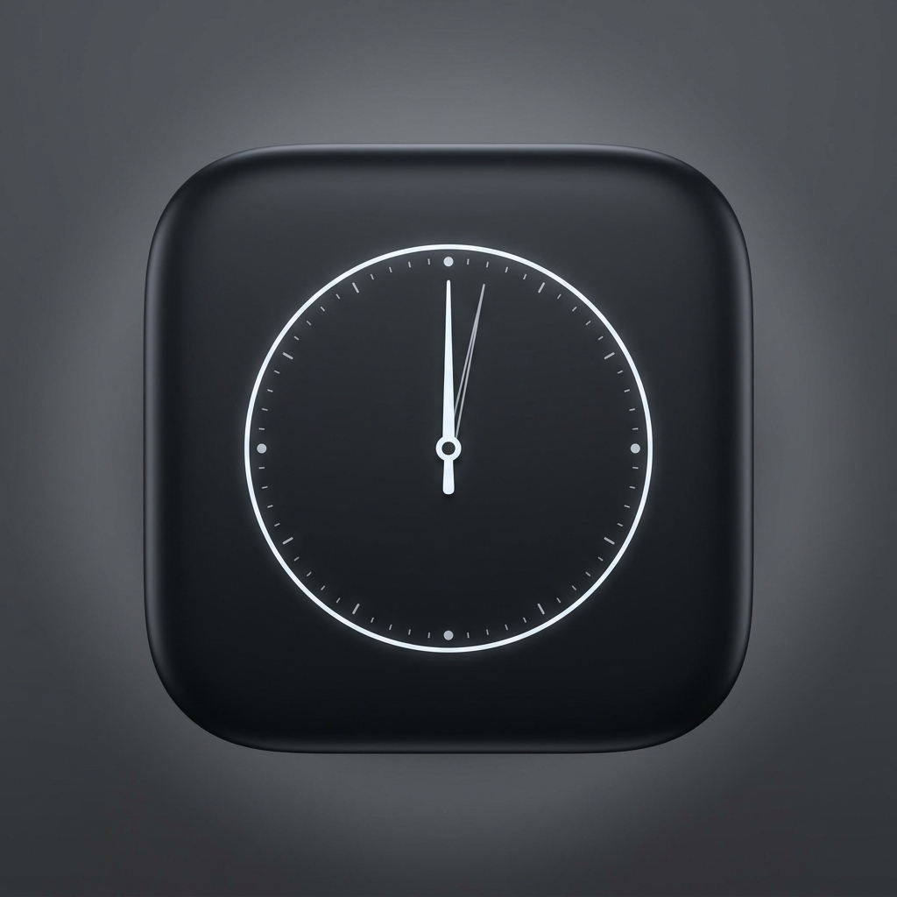

# ⏳ Know Your Time - HKDSE Past Paper Timer

<p align="center">
  
</p>

<p align="center">
  <b>A minimalist, Apple-inspired past paper timer and split-time analytics web application built for HKDSE students.</b>
</p>

<p align="center">
  <a href="https://27dser.github.io/Know-your-time/"></a>
  
  
</p>

---

## ✨ Features

- ** Pure Monochrome Apple Aesthetic**: Stark, ultra-minimalist design language with frosted glass cards, fluid layout, and high-contrast tabular typography (`font-variant-numeric: tabular-nums`).
- **⏱️ Count Up & Count Down Modes**: Precision timing engine using `performance.now()` delta calculations to eliminate browser tab timer drift.
- **⏭️ Question Lap & Skip Tracking**:
  - Record question split times (<kbd>Enter</kbd> / <kbd>L</kbd>).
  - Skip difficult questions (<kbd>S</kbd>). Skipped questions are logged with a badge and automatically excluded from average pace calculations.
- **🏷️ Customizable Question Tagging**:
  - Switch schemes: `Q1, Q2...`, `MC 1, MC 2...`, `Part A Q1...`, `Section B Q1...`.
  - Click-to-edit inline tag renaming (e.g., rename `Q3` to `Q3b` or `Essay 1`).
- **📊 Session Performance Analytics**:
  - Auto-calculates **Mean Pace** (excluding skipped & manual outliers), **Fastest Question**, **Slowest Question**, and **Completion Rate**.
- **📄 Spreadsheet Export (CSV & TSV)**:
  - Download full `.csv` reports containing an **Analysis Summary Header** + **Itemized Question Splits**.
  - One-click copy tab-separated values (TSV) for instant `Cmd+V` / `Ctrl+V` pasting into Excel or Google Sheets.
- **📱 PWA & iOS Home Screen Ready**: Works 100% offline. Add to iPhone/iPad Home Screen via Safari for a full-screen native app experience.

---

## ⌨️ Keyboard Shortcuts

Designed for hands-free paper practice while writing:

| Key | Action |
|---|---|
| <kbd>Space</kbd> | Start / Pause Timer |
| <kbd>Enter</kbd> or <kbd>L</kbd> | Record Next Question Lap |
| <kbd>S</kbd> | Skip Question |
| <kbd>R</kbd> | Reset Timer |

---

## 📲 How to Install on iOS / iPadOS

1. Open **[Live Demo](https://27dser.github.io/Know-your-time/)** in Safari on iPhone or iPad.
2. Tap the **Share** icon (up arrow button).
3. Scroll down and tap **Add to Home Screen**.
4. Tap **Add**. The custom app icon will appear on your home screen!

---

## 📄 Spreadsheet CSV Export Format

Exported `.csv` files contain a dual-section layout for academic logging:

```csv
=== HKDSE PRACTICE PAPER ANALYSIS SUMMARY ===
Date,"2026-08-26 14:30"
Practice Mode,"Count Up"
Total Duration,"01:15:30"
Total Questions,25
Completed Questions,22
Skipped Questions,3
Average Time per Completed Q,"00:03:12"
Fastest Question,"Q4 (00:01:05)"
Slowest Question,"Q18 (00:07:45)"

=== QUESTION SPLIT DETAILS ===
Question Tag,Status,Question Time (Formatted),Question Time (Seconds),Total Elapsed,Included in Mean
"Q1",Completed,00:02:15,135.0,00:02:15,Yes
"Q2",Completed,00:03:10,190.0,00:05:25,Yes
"Q3",Skipped,00:00:45,45.0,00:06:10,No
```

---

## 🛠️ Architecture

- **Zero External Dependencies**: 100% vanilla HTML5, CSS3, and JavaScript (ES6+).
- **Web Audio API**: Built-in sound generator for countdown alarm alerts.
- **LocalStorage API**: Automatic session history persistence in browser.

---

## 📜 License

This project is open-source under the [MIT License](LICENSE).
